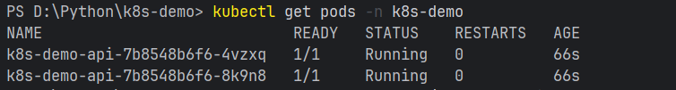
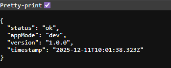
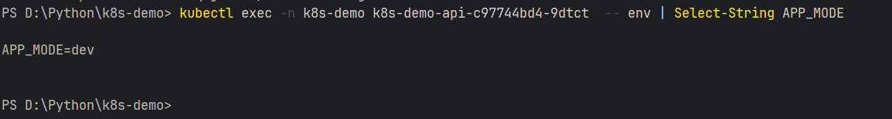
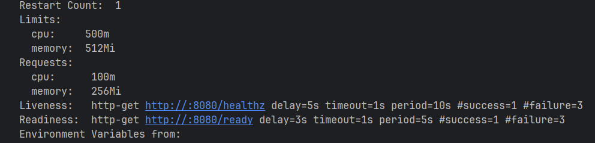
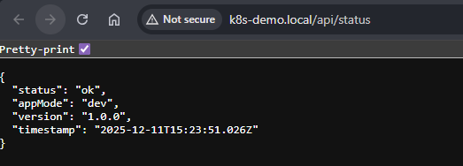
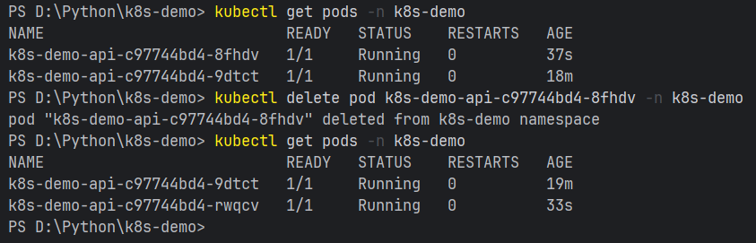

## Звіт до Лабораторної роботи №10: Kubernetes (Практична частина)

**Рівень виконання:** 90 балів

---

## Частина 1: Базове розгортання (60 балів)

### 1. Підготовка та локальний запуск
Було виконано форк репозиторію та клонування.
Встановлено залежності. Перевірено локальну роботу сервісу (ендпоінти `/api/status`, `/healthz` працюють коректно).

### 2. Контейнеризація
Створено Docker-образ застосунку.
Через особливості роботи Minikube на Windows, збірка образу виконувалася безпосередньо всередині кластера командою:
`minikube image build -t k8s-demo-app:1.0.0 .`

### 3. Запуск у Minikube
Запущено кластер Minikube з драйвером Docker.
Застосовано маніфести (`namespace`, `configmap`, `secret`, `deployment`, `service`).

**Перевірка статусу подів:**
Всі поди перейшли у статус `Running`:

### 4. Перевірка доступу (Port-Forward)
Налаштовано прокидання порту командою `kubectl port-forward`.
Запит до `http://localhost:8080/api/status` повернув коректний JSON:

## Частина 2: Конфігурація та ConfigMap (75 балів)

### 1. Робота зі змінними середовища
Початкове значення `APP_MODE` у ConfigMap було `dev`.
Було внесено зміни у файл `k8s/configmap.yaml` (зміна на `prod` та повернення на `dev`).

Було продемонстровано, що просте застосування `kubectl apply` не оновлює змінні у вже запущених процесах. Для застосування змін виконано перезапуск:
`kubectl rollout restart deployment k8s-demo-api -n k8s-demo`

**Результат перевірки змінної `APP_MODE` всередині нового пода:**

### 2. Health Checks (Liveness & Readiness)
Аналіз опису пода показав налаштовані проби:
* **Liveness:** `/healthz` (перевіряє, чи живий процес).
* **Readiness:** `/ready` (перевіряє, чи готовий сервіс приймати трафік).

**Вивід `kubectl describe pod`:**

---

## Частина 3: Ingress та Debug (90 балів)

### 1. Налаштування Ingress
Увімкнено `minikube addons enable ingress`.
Запущено `minikube tunnel` для отримання зовнішнього доступу на Windows.
Налаштовано маршрутизацію для хоста `k8s-demo.local`.

### 2. Перевірка роботи
Запит за адресою `http://k8s-demo.local/api/status` успішно пройшов через Ingress Controller до сервісу.

### 3. Демонстрація самовідновлення (Self-healing)
Було вручну видалено один із подів (`kubectl delete pod`).
Kubernetes (Deployment Controller) автоматично виявив нестачу реплік і створив новий под.

**Доказ:** На скріншоті видно, що старий под має час життя 19 хвилин, а новий, створений автоматично після видалення попереднього — лише 33 секунди.

---

## Відповіді на контрольні запитання

**1. У чому відмінність між ConfigMap та Secret?**
* **ConfigMap:** Використовується для зберігання **неконфіденційних** даних (налаштування, конфіги, змінні середовища) у відкритому текстовому вигляді.
* **Secret:** Призначений для **чутливих** даних (паролі, API-ключі, сертифікати). Дані в Secret зберігаються закодованими в Base64 і монтуються в под безпечнішим способом (часто у віртуальну пам'ять `tmpfs`, щоб не писатись на диск).

**2. У чому відмінність між liveness- та readiness-перевірками?**
* **Liveness Probe (Чи живий?):** Якщо ця перевірка провалюється, Kubernetes **вбиває** контейнер і запускає новий (рестарт). Це потрібно, якщо додаток завис намертво.
* **Readiness Probe (Чи готовий?):** Якщо ця перевірка провалюється, Kubernetes **перестає надсилати трафік** на цей под (виключає його IP з Service endpoints), але не вбиває його. Це потрібно, коли додаток ще завантажується або тимчасово перевантажений.

**3. Через які ресурси проходить запит при зверненні:**
* **Через `kubectl port-forward`:** Запит йде через API Server Kubernetes по захищеному тунелю прямо до конкретного Пода (оминаючи Service та Ingress).
* **Через `http://k8s-demo.local`:** Client (Browser) -> DNS (або `/etc/hosts`) -> Load Balancer (Minikube Tunnel) -> **Ingress Controller** (Nginx) -> **Service** (ClusterIP) -> **Pod**.

**4. Як рекомендується оновлювати конфігурацію, якщо вона надходить через env-змінні з ConfigMap?**
Оскільки змінні середовища зчитуються процесом лише в момент старту, зміна ConfigMap не впливає на працюючі поди.
**Рекомендований підхід:** Оновити ConfigMap, а потім виконати Rolling Restart деплоймента командою:
`kubectl rollout restart deployment <deployment-name>`
Це створить нові поди з новою конфігурацією і плавно замінить ними старі без простою сервісу.